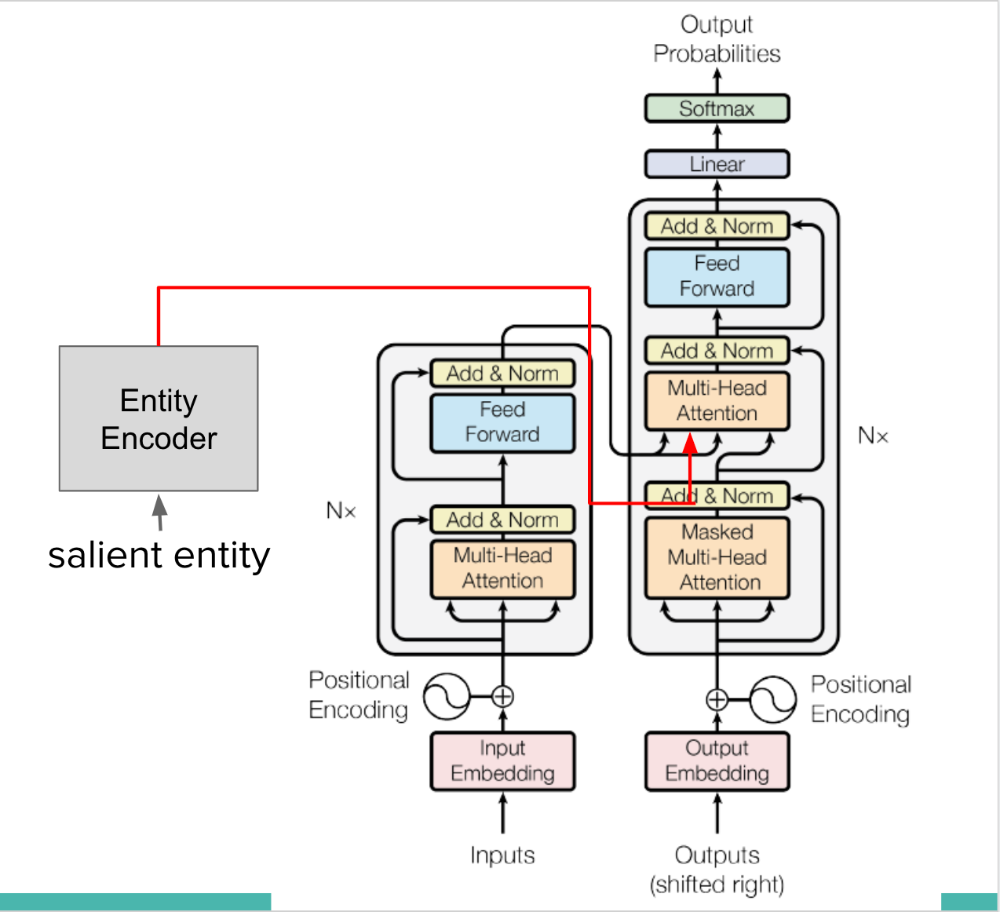

# Undergraduate Research - Automatic Text Summarization with Deep Learning
數位語音專題研究 - 使用深層學習做文章摘要

## Methods We Tried
- Multi-task learning - a part of model learns NER
- Incorporate entity information with modified attention mechanism
- Entity-Award Embedding - Add named entity information to word embedding

## Multi-Task Learning
### Type
- Soft-Sharing
- Hard Sharing

### Results
| model | ROUGE-1 | ROUGE-2 | ROUGE-L |
|:-------------|:-------------:|:-------------:|:-------------:|
| `transformer` | `6.77` | `1.62` | `1.98` |

### Discussion
- 2 datasets (CoNLL'03 & CNN/DM) differ a lot in vocab (some name entities recognized as OOV)
  - Solution 1: Add more words from NER dataset (CoNLL'03) to dictionary
  - Solution 2: Use tools to tag NER of CNN/DM dataset
- CoNLL’03 dataset too small, may lead to overfitting

## Modified Attention Mechanism

### Proposed Architecture

### Experiments
- Entity Encoder Type
  - linear
  - transformer (2 layer)
  - MLP (3 layer FFN)
- Fusion Type
  - concatenate (default)
  - gated
- NER information
  - added each layer
  - added only at last layer

## Entity-Aware Embedding
### Embedding Indicating Entity Type

### Add Entity Feature at Embedding

## Future Work
### Coreference Resolution

### Entity Encoder
